<h1 align='center'> Применение Методов Машинного Обучения для Определения
Концентрации Бактерий и их Классификации </h1>

<b>Автор проекта: Жамков Н. Д. </b>
<b>Наставник: Дьяконов А. В.</b>

 

В современном мире проблема быстрого и точного определения концентрации и типа различных бактерий является значимой в сферах медицины и пищевой промышленности. В настоящее время для этих целей часто применяется классический метод Коха, который, хотя и является стандартным в данной области, подвергается критике за свою низкую скорость детекции (24-48 часов).
В этой связи, крайне актуальна разработка более эффективных методов детекции. В своей исследовательской работе мы предлагаем инновационный метод, направленный на определение концентрации и типа бактерий с использованием передовых технологий машинного обучения. 
Предлагаемый метод способен не только решить эту проблему, но и внести существенный вклад в улучшение процессов детекции и классификации бактерий. В данной работе проведен анализ существующих методик детекции и выявлены их недостатки. Описаны преимущества нового подхода, основанного на использовании технологий машинного обучения, обеспечивающим высокую точность результатов и значительное сокращение процесса, с 24-48 часов до ~1 часа. 
Целью исследования является разработка и реализация метода определения концентрации бактерий и их классификации с использованием технологий машинного обучения. В рамках данного проекта проведен анализ различных моделей машинного обучения и выявление модели с наилучшими результатами детекции.

В работе:
1.  Проведен анализ существующих методов определения концентрации и типа бактерий.
2.  Собраны характеристики ВАХ сред с различными штаммами бактерий и составлены базы данных.
3.  Выявлены оптимальные модели машинного обучения для определения концентрации бактерий и их классификации. Подобраны параметры алгоритмов машинного обучения.
4.  Проведены сравнения метрик оценки моделей.

Доказана гипотеза, что использование модели машинного обучения в качестве способа определения концентрации бактерий и их типов значительно ускоряет процесс детекции, сохраняя точность, сравнимую с общепринятыми стандартами (методом Коха). 
Обученная нами модель может легко интегрироваться в производственные процессы пищевой промышленности, позволяя с высокой скоростью и точностью определять концентрацию микроорганизмов в сырье и продукции. Процесс детекции будет занимать менее часа, при точности определения концентрации и типа бактерии >98%, что в результате будет способствовать значительному уменьшению риска заболеваний и осложнений, вызываемых болезнетворными микроорганизмами

 

<h1 align='center'>Классический Метод Коха</h1>

Метод Коха представляет собой последовательные разведения исследуемого материала в 
расплавленном агаре с последующим переносом агара с разведенной культурой в чашку Петри.

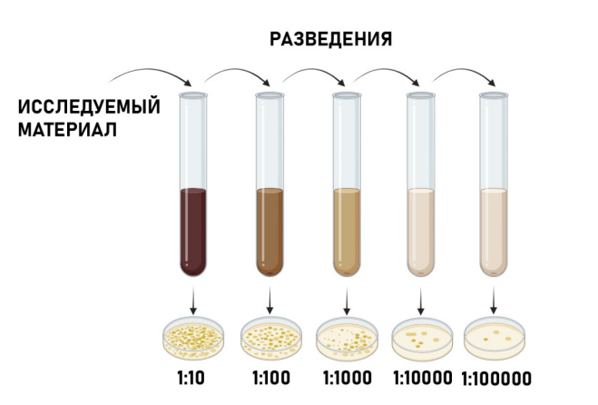</img>

Однако, несмотря на свою широкую применимость и точность, классический метод Коха
обладает значительным недостатком в виде продолжительного времени выполнения. В условиях, 
где требуется оперативный и точный анализ концентрации патогенных микроорганизмов, 
подход, который требует от <b>24 до 48 часов</b>, может оказаться <i>неэффективным и непрактичным</i>.

 

<h1 align='center'>Метрики Для Оценки</h1>

<ul>
    <li>Accuracy</li>
    <li>Precision</li>
    <li>Recall</li>
    <li>F1-score</li>
</ul>

Нас больше интересует <b>Recall</b>, так как мы делаем ставку на то, что мы сделаем меньше ошибок для положительного (возможно <i>опасного</i>) класса, нежели просто будем иметь высокую точность в общем.

 

$$ \huge Recall = \frac {TP} {TP + FN} $$

 

<h1 align='center'>Вольт-амперные Характеристики</h1>

<b>Вольт-амперные характеристики (ВАХ)</b> представляют собой зависимость тока от 
напряжения в электрической системе. В контексте исследования бактерий, ВАХ используется, к 
примеру, в электрохимической импедансной спектроскопии (EIS). Этот метод позволяет 
измерять изменения электрического сопротивления в системе, включая биологическую среду с 
микроорганизмами, под воздействием переменного электрического поля.
Учитывая поведение бактерий, использование циклической вольтамперометрии для 
обнаружения и подсчета бактерий может быть эффективным, благодаря своим преимуществам:
быстрый отклик и простое оборудование.
Кондуктометрический метод, такой как EIS, не требует меток в качестве средства 
быстрого обнаружения бактерий, что упрощает подготовку сенсора. Существуют системы на 
основе гидрогеля, используемые для обнаружения различных биологических молекул. Эта 
техника уже хорошо себя зарекомендовала как селективный метод анализа вируса клещевого 
энцефалита.
Используется гибкий гидрогель/жидкометаллический детектор для мониторинга 
бактерий в различных средах и продуктах. Такое устройство обеспечивает более быстрый и 
дешевый количественный анализ бактерий по сравнению с существующими методами.

 

<h1 align='center'>Выращивание Бактерий</h1>

Перед проведением эксперимента мы выращивали бактерии при температуре 37°C в бульоне 
LB в течение 24 часов. Затем, чтобы определить количество живых бактерий или 
колониеобразующих единиц (КОЕ), мы приготовили серию последовательных десятикратных 
разведений. Разведения достигались последовательным разбавлением бактериального 
инокулята в 10 пробирках, каждая из которых содержала 9 мл физиологического раствора 
(разведения в пределах от 10-1 до 10-9
. Затем все разведения были посажены по 1 мл на заранее 
подготовленные стерильные пластинки с питательной средой LB, используя метод заливки, и 
инкубированы при 37°C в течение 48 часов.

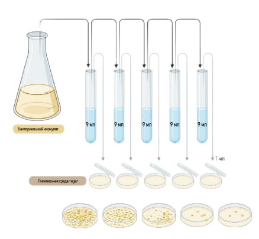</img>
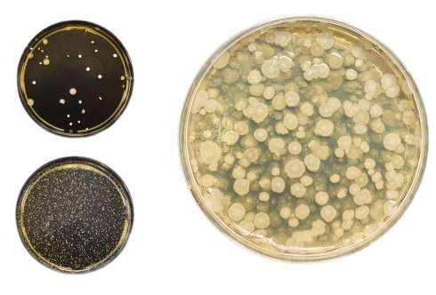</img>
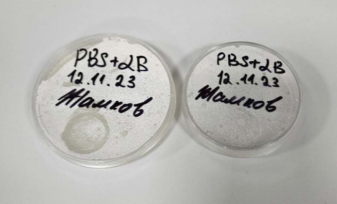</img>

 

<h1 align='center'>Сбор Данных</h1>

Сбор данных осуществлялся с использованием потенциостата «<b>Keithley 6430</b>». 
Обучающий набор данных был структурирован с 40 отдельными образцами для каждого 
класса. Для каждого образца записывались пять циклических вольтамперограмм (CVAs). 
Каждый набор электрохимических ответов характеризовался серией из <b>400</b> значений тока (200 
точек forward, 200 reverse). Тестовый набор данных состоял из трех образцов для каждого 
класса. В режиме изменения напряжения применялись следующие потенциальные диапазоны:

<ul>
    <li>от -0.02 до 0.02 В</li>
    <li>от -0.1 до 0.1 В</li>
    <li>от -0.5 до 0.5 В</li>
    <li>от -1 до 1 В</li>
    <li>от -5 до 5 В</li>
</ul>

 

<h1 align='center'>Обработка Данных</h1>

Полученные данные по ВАХ были собраны и предоставлены в виде таблицы формата 
*.csv (comma-separated values). Информация была обработана с помощью библиотеки для 
анализа данных Pandas. В качестве языка программирования был выбран Python 3.10.6.
Данные были разделены на две базы. Одна база данных хранила информацию о ВАХ 
кишечной палочки (<i>E. coli</i>), вторая хранила информацию о кисломолочных бактериях (<i>B.
coagulans и S. thermophilus</i>).

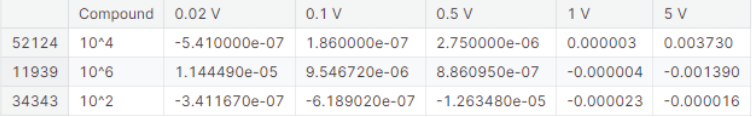</img>

Для Концетрации (Compound)

 

Мы решили применить «<b>UnderSampling</b>» в целях предотвращения классового дисбаланса
(явление, при котором количество объектов одного класса больше, чем количество объектов 
других классов). Другими словами, мы убрали дисбаланс, сократив количество объектов 
превосходствующего типа до наименьшего значения, уровняв количество объектов по всем 
данным:

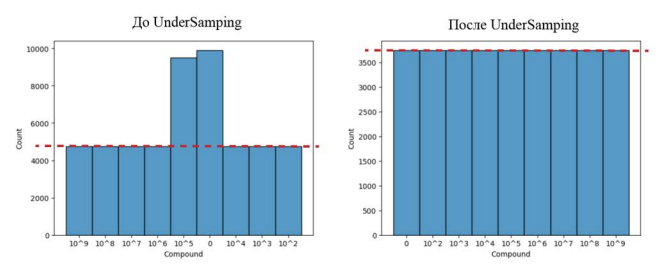</img>

 

Далее, к данным были применены «скейлеры» и «нормализаторы», которые приводят 
значения факторов к определенному диапазону. «Скейлеры» помогают таким алгоритмам
машинного обучения, как SVM (Support Vector Machines) и K-NN (K-ближайших соседей), так 
как эти алгоритмы основываются на расстоянии между точками данных. Также, скейлинг 
16
помогает с стабилизацией чувствительности модели машинного обучения к начальным 
значениям.
Дополнительно был создан единый датасет, хранящий в себе информацию только о ВАХ 
и названии самой бактерии. Этот датасет будет отвечать за проверку гипотезы о том, что 
обучение алгоритма на ВАХ способно классифицировать тип бактерии.

 

<h1 align='center'>Выявление Наиболее Оптимальной Модели МО. Концентрация</h1>

Самыми точными моделями, по версии микробиологических научных работ, являются<b> 
SVM, RFC (Random Forest Classifier) и ANN (Artificial Neural Network)</b>. Так как эти модели 
показали себя лучше всего, они станут одними из главных алгоритмов для проверки. Также в 
список моделей на оценку точности, попадут «бустинговые» модели.

Полный список моделей (будет дополняться):

<ul>
    <li>Random Forest Classifier (RFC)</li>
    <li>Support Vector Classifier (SVC)</li>
    <li>TabNet (TN)</li>
    <li>Extra Trees Classifier (ETC)</li>
    <li>Catboost Classifier (CBC)</li>
    <li>Logistic Regression (LR)</li>
</ul>

 

<h3>Результаты работы моделей для определения концентрации Киш. Палочки:</h3>

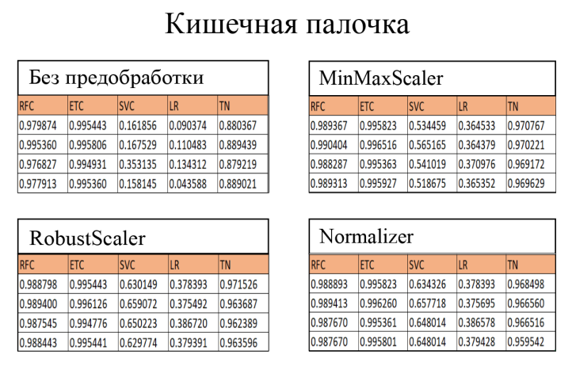</img>

<h3>Результаты работы моделей для определения концентрации Кисломолоч. Бактерий:</h3>

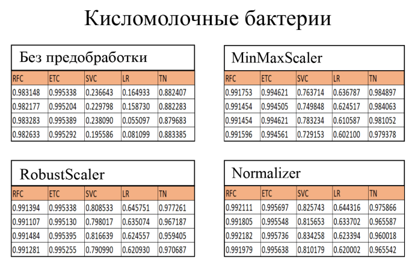</img>

 

Заметим, что из четырех способов обработки данных, лучше всего себя проявляет 
<b>RobustScaler и MinMaxScaler</b>. Невозможно определить лучший тип предобработки, так как 
скейлинг влияет на каждую модель по-своему. 
Из полученных результатов делаем вывод о том, что <b>SVC и LR</b> не являются 
конкурентоспособными моделями для детекции концентрации бактерий, используя ВАХ, так 
как точности этих моделей заметно ниже, чем у остальных оцененных алгоритмов. Модель 
глубокого обучения TabNet, обученная на 600 эпохах, выдает результат по метрике Recall не 
выше 0.9849, что является не самым оптимальным результатом для определения концентрации 
бактерий.

RFC и ETC после кросс-валидации:
<ul><b>
    <li>Random Forest Classifier: 0.991555</li>
    <li>Extra Trees Classifier: 0.997550</li></b>
</ul>

Можно заметить, что в результатах не указан «CatBoost Classifier». Эта модель бустинга 
была оптимизирована и ее параметры были подобраны, используя GridSearchCV. Параметры
для перебора: <i>depth, od_wait, l2_leaf_reg, iterations, leanring_rate</i>. Результаты тренировки:

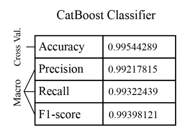</img>

 

<h3>Гистограмма Recall-ов лучших 3-ех моделей:</h3>

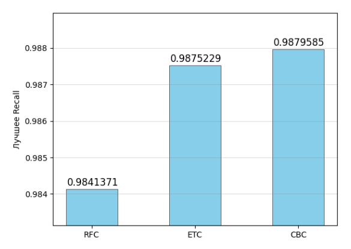</img>

Из трех лучших моделей, самой оптимальной является <b>«Catboost Classifier» (CBC)</b>, 
поскольку данная модель имеет большой спектр параметров для подбора; менее всего 
подвержена переобучению; способна выполнять процесс тренировки, используя графический 
процессор и, <i>тем самым</i>, ускоряя процесс тренировки и/или подбора параметров.

 

<h1 align='center'>Выявление Наиболее Оптимальной Модели МО. Тип Микроорганизма</h1>

Список моделей и методы предобработки данных остаются такими же, за исключением метрик. Среднее значение по метрикам будет считаться относительно 
двух классов, так как выполняется задача бинарной классификации.
Целевой переменной становится колонка <b>«Name» (тип бактерии), вместо «Compound»</b>. 1 –
Кишечная палочка, 0 – Кисломолочные бактерии.
Новый датасет выглядит следующим образом:

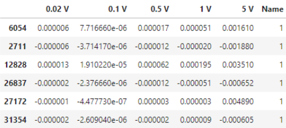</img>

 

<h3>Результаты для моделей при определении типа бактерии:</h3>

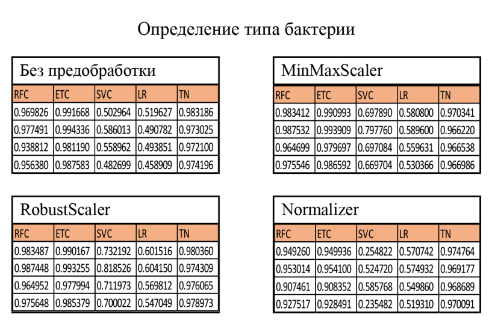</img>

 

Модели LR и SVC имеют, в среднем, большую точность при классификации типа бактерии, 
чем при детекции концентрации бактерий, однако данные алгоритмы все еще не являются 
конкурентоспособными по сравнению с другими моделями. TN имеет достаточно высокую 
точность, но эта модель не самая оптимальная в контексте определения типа бактерии.

Лидерами по точности остаются RFC и ETC. Проверим их точность на кросс-валидации:

<ul><b>
    <li>Random Forest Classifier: 0.99549651</li>
    <li>Extra Trees Classifier: 0.99797328</li></b>
</ul>

 

<h3>Результат для оптимизированного CBC</h3>

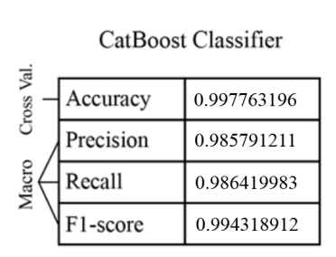</img>

 

<h3>Гистограмма Recall-ов лучших 3-ех моделей (определение типа):</h3>

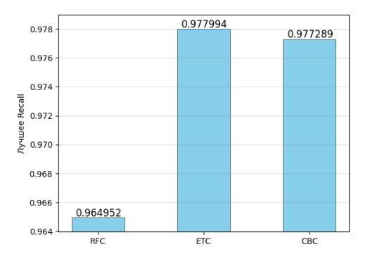</img>

 

Делаем однозначный вывод о том, что применение модели <b>«Catboost Classifier»</b> в качестве 
алгоритма для определения концентрации микроорганизма и его типа является наиболее 
оптимальным. Эта модель, по результатам эксперимента, проявила себя в качестве одной из 
самых точных моделей из проверяемых. Стоит упомянуть, что «Catboost» склонен к 
переобучению намного меньше, чем <i>RFC или ETC</i>. Высокие показатели точности 
переобученной модели тестовой выборки на одних данных не всегда могут означать высокую 
точность на другом датасете. 

 

<h1 align='center'>Выводы</h1>

Использование моделей машинного обучения при определении концентрации бактерий и 
их классификации оказалось значительно более эффективным по сравнению с традиционными 
методами, такими как классический метод Коха. Кроме того, <b>«CatBoost Classifier»</b> оказался 
наиболее оптимальной моделью для задачи классификации, превосходя другие алгоритмы не 
только по метрикам точности – с <i>Recall равной ~0.98641</i>, но и по числу параметров для 
оптимизации. Наиболее оптимальным методом предобработки стали <u>«RobustScaler» и 
«MinMaxScaler»</u>, повышая точность алгоритмов в среднем примерно на 0.5%. Эксперименты 
подтвердили высокую эффективность применения алгоритмов машинного обучения на практике, 
демонстрируя высокую скорость и точность классификации. Гипотеза об эффективности моделей 
машинного обучения в детекции концентрации микроорганизмов и их типа была успешно 
подтверждена.

<b>Перспектива развития проекта</b> заключается в дальнейшем исследовании и 
усовершенствовании методов определения концентрации и классификации типов бактерий. 
Основные направления включают в себя проверку и оптимизацию моделей машинного обучения 
для повышения точности и эффективности. Кроме того, расширение области исследования на 
альтернативных биоматериалах позволит оценить работу нашего алгоритма на неизученных
микроорганизмах. Важным этапом является возможность интеграции разработанной системы в 
промышленные процессы, что открывает перспективы для использования в реальных условиях 
производства. Таким образом, проект не только предоставляет инновационные методы детекции, но 
и имеет потенциал к практическому применению.

